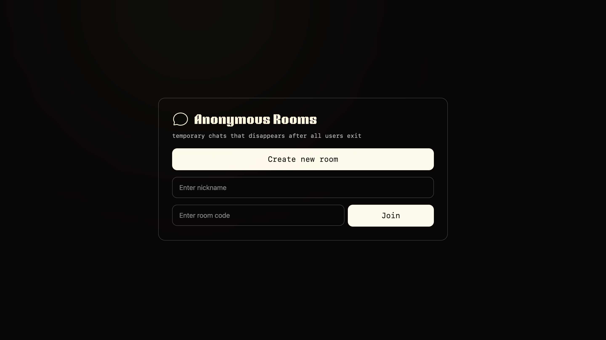
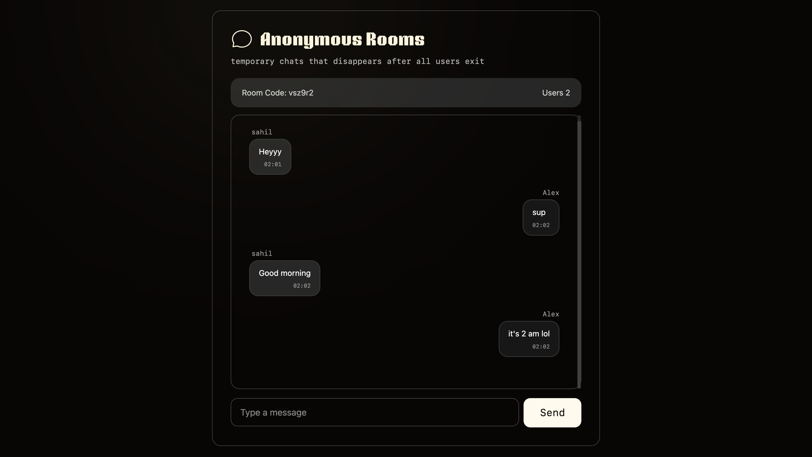

# 💬 Anonymous Rooms - Real-time Chat Application

A lightweight, anonymous chat application where users can create temporary chat rooms that disappear when everyone leaves. Built with WebSockets for real-time communication.





## ✨ Features

- **Anonymous Chatting** - No sign-up required, just pick a nickname
- **Real-time Messaging** - Instant message delivery using WebSockets
- **Temporary Rooms** - Rooms auto-delete when the last user leaves
- **Live User Count** - See how many people are in the room
- **Responsive Design** - Works seamlessly on mobile and desktop
- **Clean UI** - Modern, minimalist interface with smooth animations

## 🏗️ Architecture

This is a **monorepo** containing both frontend and backend in a single repository:

```
Chat_app_websockets/
├── ChatAppBE/          # Backend (Node.js + Express + WebSocket)
└── ChatAppFE/          # Frontend (React + TypeScript + Vite)
```

### Tech Stack

**Frontend:**
- React 19.2.0 with TypeScript
- Vite for blazing-fast builds
- Tailwind CSS v4 for styling
- React Router for navigation
- Axios for HTTP requests
- Native WebSocket API for real-time communication

**Backend:**
- Node.js with Express 5
- WebSocket server (ws library)
- TypeScript for type safety
- In-memory data storage (Map)

### How It Works

```
┌─────────────┐                  ┌─────────────┐
│   Browser   │                  │   Browser   │
│  (User A)   │                  │  (User B)   │
└──────┬──────┘                  └──────┬──────┘
       │                                │
       │ HTTP: Create Room              │
       ├────────────────────────────────┼──────────┐
       │                                │          │
       │ WS: Join Room                  │          ▼
       ├────────────────────────┐       │   ┌──────────┐
       │                        │       │   │  Express │
       │ WS: Send Message       │       │   │  Server  │
       ├────────────────────────┤       │   └────┬─────┘
       │                        │       │        │
       │                        ▼       │        │
       │                    ┌───────────┴────────┴─┐
       │                    │   WebSocket Server   │
       │◄───────────────────┤                      │
       │   Broadcast        │  - Room Management   │
       │                    │  - Message Routing   │
       │                    │  - User Tracking     │
       └────────────────────┤                      │
                            └──────────────────────┘
```

**Flow:**
1. **User A** creates a room → Backend generates a unique 6-character code
2. **User A** joins the room → WebSocket connection established
3. **User B** joins using the room code → Both users connected
4. Messages sent by either user are broadcast to everyone in that room
5. When all users leave → Room is automatically deleted

## 📡 WebSocket Message Protocol

All WebSocket messages follow this JSON structure:

```typescript
{
  type: string,      // Message type identifier
  payload: object    // Data specific to the message type
}
```

### Message Types

#### 1. **join** (Client → Server)
User joins a room
```json
{
  "type": "join",
  "payload": {
    "roomCode": "ABC123",
    "username": "Alice"
  }
}
```

#### 2. **joined** (Server → Client)
Confirmation that you successfully joined
```json
{
  "type": "joined",
  "payload": {
    "roomCode": "ABC123",
    "user": "Alice",
    "userCount": 1
  }
}
```

#### 3. **user-joined** (Server → Other Clients)
Notifies others when a new user joins
```json
{
  "type": "user-joined",
  "payload": {
    "user": "Bob",
    "userCount": 2
  }
}
```

#### 4. **message** (Bidirectional)
**Client → Server:**
```json
{
  "type": "message",
  "payload": {
    "msg": "Hello everyone!",
    "sessionId": "uuid-here"
  }
}
```

**Server → All Clients:**
```json
{
  "type": "message",
  "payload": {
    "msg": "Hello everyone!",
    "user": "Alice",
    "time": 1673596800000,
    "sessionId": "uuid-here"
  }
}
```

#### 5. **user-left** (Server → Clients)
Notifies when a user disconnects
```json
{
  "type": "user-left",
  "payload": {
    "user": "Bob",
    "userCount": 1
  }
}
```

#### 6. **error** (Server → Client)
Error messages
```json
{
  "type": "error",
  "payload": {
    "message": "Invalid room code"
  }
}
```

### Session ID System

To distinguish your own messages from others (for UI alignment), each client generates a unique `sessionId` on connection:

- Messages you send include your `sessionId`
- Server echoes it back in the broadcast
- Frontend compares: if `sessionId === yours` → align right, else align left

This solves the duplicate username problem without needing user authentication!

## 🚀 Getting Started

### Prerequisites
- Node.js 18+ 
- npm or yarn

### Local Development

1. **Clone the repository**
   ```bash
   git clone <your-repo-url>
   cd Chat_app_websockets
   ```

2. **Setup Backend**
   ```bash
   cd ChatAppBE
   npm install
   npm run dev
   ```
   Backend runs on `http://localhost:8000`

3. **Setup Frontend**
   ```bash
   cd ../ChatAppFE
   npm install
   npm run dev
   ```
   Frontend runs on `http://localhost:5173`

4. **Open your browser**
   - Go to `http://localhost:5173`
   - Create a room or join an existing one
   - Open another browser/incognito window to test real-time chat!

## 📦 Deployment

### Backend (Railway)

1. Push your code to GitHub
2. Go to [Railway.app](https://railway.app)
3. Create new project → Deploy from GitHub
4. Set **Root Directory** to `ChatAppBE`
5. Add environment variable (optional):
   - `FRONTEND_URL` = your Vercel URL
6. Railway auto-detects Node.js and deploys!

### Frontend (Vercel)

1. Go to [Vercel.com](https://vercel.com)
2. Import your GitHub repository
3. Set **Root Directory** to `ChatAppFE`
4. Add environment variables:
   - `VITE_API_URL` = `https://your-railway-url.up.railway.app`
   - `VITE_WS_URL` = `wss://your-railway-url.up.railway.app`
5. Deploy!

## 🎨 UI Features

- **Custom Scrollbar** - Styled scrollbar that matches the dark theme
- **Glow Effect** - Subtle radial gradient background accent
- **Smooth Animations** - Slide-down alerts and smooth scrolling
- **Custom Fonts** - NTBrickSans for headings, SF Mono for codes
- **Message Bubbles** - Different styles for your messages (right, lighter) vs others (left, darker)

## 🗂️ Data Storage

**In-Memory Only** - No database required!

```typescript
rooms: Map<roomCode, Set<WebSocket>>       // Active rooms and their connections
clients: Map<WebSocket, {user, roomCode}>  // Client info for each connection
```

When the last user leaves a room, it's deleted from memory. This keeps the app lightweight and ensures privacy!

**This is a demo app** 

## 🛠️ Environment Variables

### Backend (.env)
```env
PORT=8000                    # Server port (Railway auto-assigns)
FRONTEND_URL=                # Your frontend URL for CORS
```

### Frontend (.env)
```env
VITE_API_URL=http://localhost:8000      # Backend HTTP API
VITE_WS_URL=ws://localhost:8000         # Backend WebSocket (wss:// in production)
```

## 🎯 Future Improvements

- [ ] Message encryption
- [ ] File/image sharing
- [ ] Typing indicators
- [ ] Read receipts
- [ ] Room passwords
- [ ] Message history 
- [ ] Emoji reactions
- [ ] Dark/light theme toggle
- [ ] Voice messages

## 📄 License

MIT License - feel free to use this project for learning or building your own chat app!

## 🤝 Contributing

Pull requests are welcome! For major changes, please open an issue first.

---

