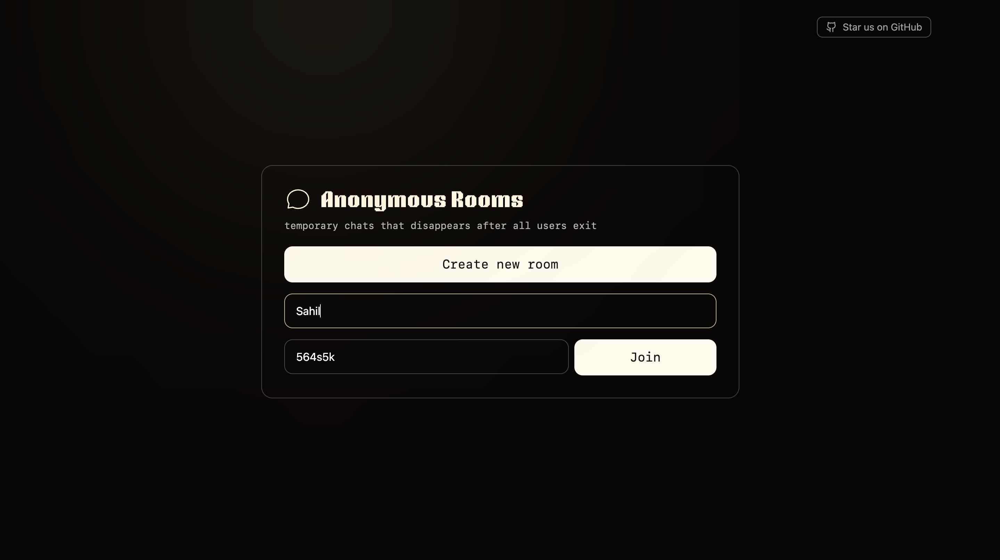
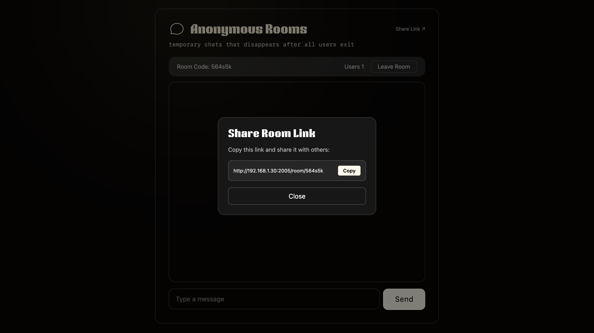
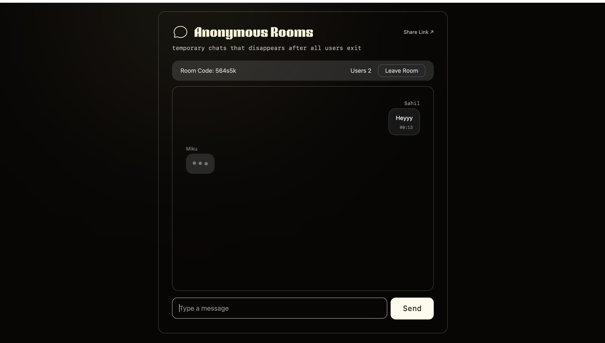
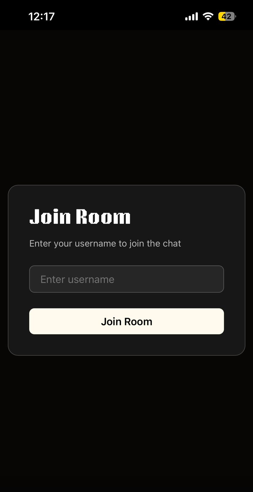
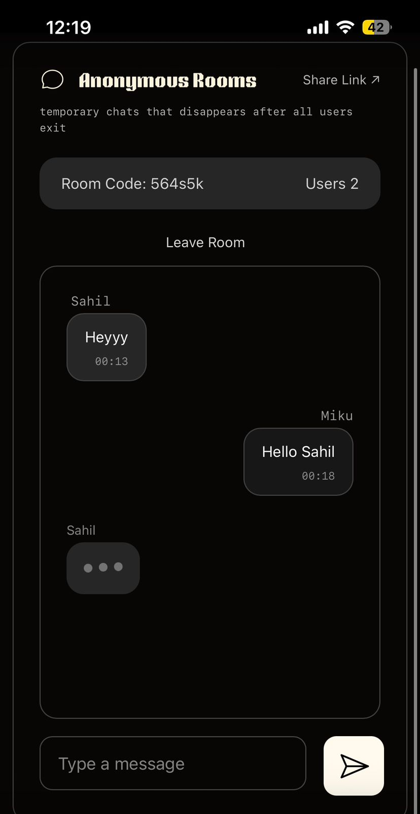

# 💬 Anonymous Rooms v2 - Real-time Chat Application

A production-ready anonymous chat application featuring real-time messaging, typing indicators, persistent message history, and multi-device support. Built with WebSockets for instant communication.





<div style="display: flex; gap: 20px; justify-content: center; flex-wrap: wrap;">
  
  
</div>

## ✨ Features

- **🔄 Real-time Messaging** - Instant message delivery using WebSockets
- **⌨️ Live Typing Indicators** - See who's typing in real-time with animated indicators
- **💾 Message Persistence** - Last 100 messages cached in localStorage (survives page refresh)
- **📱 Mobile-First Design** - Fully responsive on phones, tablets, and desktop
- **🔗 Smart Link Sharing** - Share room links that work across devices with dynamic routing
- **🎯 Session Management** - Per-tab session isolation prevents multi-tab conflicts
- **⏱️ Room Lifecycle Management** - Rooms stay alive for 5+ minutes even with 0 users (grace period for link sharing)
- **👥 Live User Count** - Real-time user presence tracking
- **🎨 Smooth Animations** - Polished UI with fade transitions and scroll animations
- **Anonymous** - No sign-up required, completely private
- **Auto-cleanup** - Rooms auto-delete after 5 minutes of inactivity

## 🏗️ Architecture

### Project Structure

```
Chat_app_websockets/
├── ChatAppBE/              # Backend (Node.js + Express + WebSocket)
│   ├── src/
│   │   ├── index.ts       # WebSocket server, room management, cleanup job
│   │   └── utils.ts       # Helper functions
│   └── package.json
└── ChatAppFE/              # Frontend (React + TypeScript + Vite)
    ├── src/
    │   ├── pages/
    │   │   ├── Landing.tsx # Create/join rooms
    │   │   └── Room.tsx    # Chat interface, typing indicators, message handling
    │   ├── components/
    │   │   ├── Message.tsx
    │   │   ├── TypingBubble.tsx # Animated typing indicator
    │   │   ├── Alert.tsx
    │   │   └── ...
    │   └── main.tsx
    └── package.json
```

### Tech Stack

**Frontend:**
- ⚛️ React 18 with TypeScript
- ⚡ Vite (instant HMR, optimized builds)
- 🎨 Tailwind CSS v4
- 🧭 React Router (dynamic routes)
- 📡 Native WebSocket API
- 🎭 Custom hooks (useThrottle, useDebounce)

**Backend:**
- 🟢 Node.js + Express
- 🔌 WebSocket server (ws library)
- 📝 TypeScript for type safety
- 💾 In-memory room storage with automatic cleanup

### Data Flow Architecture

```
┌──────────────────────────────────────────────────────────────┐
│                     FRONTEND (React)                          │
│  ┌───────────────────────────────────────────────────────┐   │
│  │ Room.tsx                                              │   │
│  │ • Message state (msgs[])                             │   │
│  │ • Typing state (typingUsers Map)                     │   │
│  │ • Connection state (isConnected)                     │   │
│  │ • WebSocket ref (ws.current)                         │   │
│  └─────┬───────────────────────────────────────────────┘    │
│        │                                                       │
│  STORAGE LAYER:                                              │
│  • sessionStorage: Session data (per-tab)                    │
│  • localStorage: Last 100 messages (persistent)              │
└────────┼─────────────────────────────────────────────────────┘
         │
    WebSocket (WS)
    Persistent Connection
         │
┌────────▼─────────────────────────────────────────────────────┐
│                  BACKEND (Node.js)                            │
│  ┌──────────────────────────────────────────────────────┐    │
│  │ WebSocket Server                                     │    │
│  │ • rooms: Map<roomCode, RoomData>                    │    │
│  │   - messageHistory: Message[]                       │    │
│  │   - clientsMap: Map<sessionId, ClientInfo>         │    │
│  │   - emptyingSince: timestamp (for cleanup)         │    │
│  │ • clients: Map<WebSocket, ClientMetadata>          │    │
│  └────────┬────────────────────────────────────────────┘    │
│           │                                                    │
│  ┌────────▼────────────────────────────────────────────┐    │
│  │ Cleanup Job (runs every 1 min)                      │    │
│  │ • Checks if room.emptyingSince > 5 mins            │    │
│  │ • Deletes stale empty rooms                        │    │
│  │ • Resets timer when users rejoin                   │    │
│  └─────────────────────────────────────────────────────┘    │
└──────────────────────────────────────────────────────────────┘
```

### Design Decisions

#### 1. **Hybrid Storage Strategy**
- **sessionStorage** for session data:
  - Automatically cleared when tab closes
  - Isolated per-tab (prevents multi-tab conflicts)
  - Contains: roomCode, nickname, sessionId, timestamp
  
- **localStorage** for message history:
  - Survives page refresh and reconnects
  - Capped at 100 messages (memory efficient)
  - Delta sync: Only fetch messages newer than last stored

**Why?** Balances persistence with privacy and prevents users from accidentally joining old rooms.

#### 2. **Session ID System**
Instead of username-based identification:
- Each browser instance gets a unique UUID stored in localStorage
- Persists across sessions
- Allows reconnection detection within 60-second grace period
- No authentication overhead

**Why?** Maintains anonymity while enabling reconnection and message alignment.

#### 3. **5-Minute Room Grace Period**
Rooms don't delete immediately when empty:
- Set `emptyingSince` timestamp when last user leaves
- Cleanup job (runs every 1 min) checks: `now - emptyingSince > 5 mins`
- If user rejoins within 5 mins, timestamp resets

**Why?** Users sharing links via text/voice have time to open them without room vanishing.

#### 4. **Typing Indicators with Throttling**
- Client throttles typing events to 500ms intervals
- Server broadcasts to all room members except sender
- Auto-clears after 3 seconds of inactivity (prevents stale indicators)
- Max 3 typing users displayed (sorted by recency)
- Smooth fade-out animation (300ms) before removal

**Why?** Reduces server load while maintaining responsive UX.

#### 5. **Dynamic URL Routing**
Changed from query parameters to dynamic routes:
- Old: `/room?roomCode=ABC123`
- New: `/room/ABC123` (cleaner, better for sharing)

**Why?** More intuitive for users, easier to remember, better for link previews.

#### 6. **Message History Transformation**
Backend stores minimal format:
```json
{ msg, user, time, sessionId }
```

Frontend transforms for UI display:
```json
{ user, msg, hours, minutes, isSelf }
```

**Why?** Separates storage concerns from presentation logic.

## 📱 Mobile Support

✅ **Fully Responsive Design**
- Touch-friendly buttons and inputs
- Auto-scrolling on new messages
- Optimized for 320px (iPhone SE) to 2560px+ (desktop)
- Safe area padding for notch/home indicator

✅ **Mobile-Specific UX**
- Simplified button layout (icon-only send button)
- Larger tap targets (44px minimum)
- Keyboard-aware scrolling
- Native share API fallback to modal

✅ **Performance**
- Lazy-loaded components
- Optimized re-renders (React.memo on Message)
- Efficient state updates (Map for typing users)

## 🔮 Upcoming Features

### Image & File Sharing (Q1 2026)
- **Upload pipeline** using Cloudinary or AWS S3
- **Image preview** before sending
- **Client-side compression** to reduce bandwidth
- **Inline image display** in chat with lightbox
- **File type validation** (images only initially)

Implementation approach:
```
User selects file
  ↓
Client compresses/resizes (sharp.js)
  ↓
Upload to Cloudinary/S3 (multipart form)
  ↓
Get secure CDN URL
  ↓
Send via WebSocket with message
  ↓
Server broadcasts URL to room
  ↓
Frontend renders  inline
```

This will maintain the anonymous philosophy while adding rich media support.

## 📡 WebSocket Message Protocol

### Message Types

#### **join** (Client → Server)
```json
{
  "type": "join",
  "payload": {
    "roomCode": "ABC123",
    "username": "Alice",
    "sessionId": "uuid-xxx",
    "lastMessageTime": 1704067200000
  }
}
```

#### **joined** (Server → Client)
```json
{
  "type": "joined",
  "payload": {
    "roomCode": "ABC123",
    "user": "Alice",
    "userCount": 1,
    "msgs": [
      { "msg": "Hello", "user": "Bob", "time": 1704067200000, "sessionId": "uuid-yyy" }
    ]
  }
}
```

#### **message** (Bidirectional)
```json
{
  "type": "message",
  "payload": {
    "msg": "Hello everyone!",
    "user": "Alice",
    "time": 1704067200000,
    "sessionId": "uuid-xxx"
  }
}
```

#### **typing** (Client → Server → Others)
```json
{
  "type": "typing",
  "payload": {
    "user": "Alice",
    "sessionId": "uuid-xxx"
  }
}
```

#### **user-joined** / **user-left** (Server → Clients)
```json
{
  "type": "user-joined",
  "payload": {
    "user": "Bob",
    "userCount": 2
  }
}
```

#### **error** (Server → Client)
```json
{
  "type": "error",
  "payload": {
    "message": "Room closed"
  }
}
```

## 🚀 Getting Started

### Prerequisites
- Node.js 18+
- npm or yarn

### Local Development

**1. Clone & Install**
```bash
git clone <repo-url>
cd Chat_app_websockets

# Backend
cd ChatAppBE
npm install
npm run dev

# Frontend (new terminal)
cd ChatAppFE
npm install
npm run dev
```

**2. Open Browser**
- Frontend: `http://localhost:5173`
- Backend: `ws://localhost:8000`

**3. Test Real-Time Chat**
- Create room in one window
- Open another browser/incognito
- Share room code
- Chat in real-time!

### Environment Variables

**Backend (.env)**
```env
PORT=8000
FRONTEND_URL=http://localhost:5173
```

**Frontend (.env)**
```env
VITE_API_URL=http://localhost:8000
VITE_WS_URL=ws://localhost:8000
```

## 📦 Deployment

### Backend (Railway)
```bash
# Push to GitHub
git push origin main

# Railway → Import from GitHub
# Set root directory: ChatAppBE
# Deploy (auto-detects Node.js)
```

### Frontend (Vercel)
```bash
# Vercel → Import from GitHub
# Set root directory: ChatAppFE
# Environment variables:
#   VITE_API_URL = https://your-railway.up.railway.app
#   VITE_WS_URL = wss://your-railway.up.railway.app
# Deploy!
```

## 🧪 Testing Scenarios

### Multi-Device Sharing
1. Create room on mobile
2. Share link via QR code or text
3. Open on desktop
4. Both see real-time messages and typing

### Session Persistence
1. Send messages in room
2. Refresh page → Messages still visible (localStorage)
3. Close and reopen tab → Session restored (sessionStorage)

### Grace Period
1. Last user leaves room
2. Within 5 minutes, user opens shared link
3. Room still exists, message history intact

### Typing Indicators
1. User A starts typing
2. User B sees animated "User A is typing..." bubble
3. After 3s without typing, indicator fades out

## 📊 Performance Metrics

- **WebSocket Latency**: <50ms (local), ~200ms (production)
- **Message Delivery**: <100ms across room
- **Typing Indicator Latency**: ~50ms throttled updates
- **Memory per Room**: ~50KB (100 messages + metadata)
- **Initial Load**: ~2.3MB (gzipped)

## 🎨 UI Components

- **Message**: Self/other message bubbles with timestamps
- **TypingBubble**: Animated 3-dot indicator with fade-out
- **Alert**: Toast-style notifications (success/error/info)
- **Input**: Text input with disabled state on disconnect
- **Button**: Ghost/filled variants with disabled state
- **ShareLinkModal**: Copy-to-clipboard with fallback
- **UsernameModal**: Join prompt for shared links

## 🛠️ Key Algorithms

### Delta Sync
```typescript
// Only fetch messages newer than last stored
msgs = messageHistory.filter((m) => m.time > lastMessageTime)
```

### Message Trimming
```typescript
// Keep only last 100 messages
trimmedMsgs = messages.slice(-100)
```

### Room Cleanup
```typescript
// Every 1 minute, check empty rooms
if (room.clientsMap.size === 0 && now - room.emptyingSince > 5mins) {
  rooms.delete(roomCode)
}
```

### Typing Timeout
```typescript
// Clear after 3 seconds of inactivity
setTimeout(() => {
  setRemovingTypingUsers(add(sessionId))  // Fade out
  setTimeout(() => {
    setTypingUsers(delete(sessionId))     // Remove
  }, 300)
}, 3000)
```

## 📄 License

MIT License - Open source and free to use!

## 🤝 Contributing

Contributions welcome! Please open issues or PRs for bugs/features.

---

**v2.0 Release | January 2026**

Learn more: [WebSocket API Docs](https://developer.mozilla.org/en-US/docs/Web/API/WebSocket) | [React Hooks](https://react.dev/reference/react)
